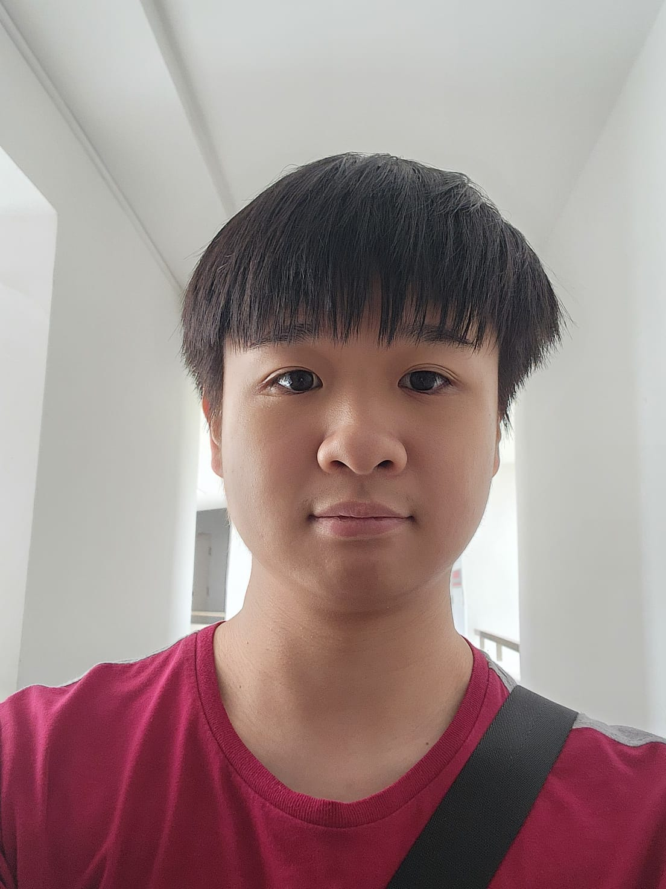

## Project team

---
  layout: default.md
  title: "About Us"
---

# About Us

We are a team based in the [School of Computing, National University of Singapore](http://www.comp.nus.edu.sg).

You can reach us at the email `seer[at]comp.nus.edu.sg`

## Project team

### Dexter Leng

[[github](https://github.com/dexterleng)]
[[portfolio](team/dexterleng.md)]

* Role: Backend Developer
* Responsibilities: Adding functionality

### Jovan Yo

[[github](https://github.com/suspectblue)]
[[portfolio](team/suspectblue.md)]

* Role: Backend Developer
* Responsibilities: Adding functionality

### Adwin Ang

[[github](http://github.com/adwinang)]
[[portfolio](team/angYongXiangAdwin.md)]

### Kara Rei

[[github](https://github.com/kararei)]
[[portfolio](team/kararei.md)]

### Zyon Wee

[[github](https://github.com/zyonwee)]
[[portfolio](team/zyonwee.md)]

* Role: Software Architect
* Responsibilities: Adding functionality
