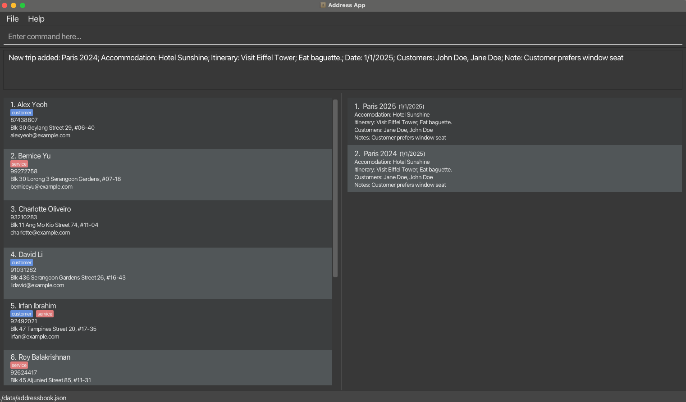
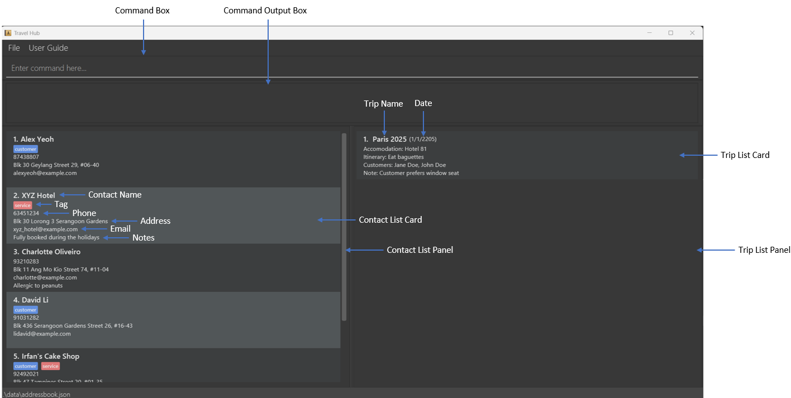

# TravelHub User Guide

TravelHub is a contact management app designed to help travel agents efficiently manage customer information and service details, such as addresses and contact information. Using a simple command-line interface, it supports **adding, deleting, tagging of contact profiles and trips**.

<!-- * Table of Contents -->
<page-nav-print />

--------------------------------------------------------------------------------------------------------------------

## Quick start

1. Ensure you have Java `17` or above installed in your Computer.<br> 
   **Windows users:** Download and install JDK 17 from [here](https://www.oracle.com/java/technologies/downloads/#java17)<br>
   **Mac users:** Ensure you have the precise JDK version prescribed [here](https://se-education.org/guides/tutorials/javaInstallationMac.html).
   * Open a command terminal (Windows: search for _cmd_ , Mac: use Spotlight to find _Terminal_ )
   * Verify installation by typing `java -version` in your terminal 
   

2. Download the `TravelHub.jar` file from the latest release [here](https://github.com/AY2425S2-CS2103-F09-1/tp/releases).
   * The `.jar` file will be listed under the Assets dropdown of the latest version - click on it to begin your download
   

3. Copy the `TravelHub.jar` file to the folder you want to use as the _home folder_ for TravelHub. Other additional folders (e.g. data folder) will be created within this _home folder_.


4. Open a command terminal, `cd` into the folder you put the jar file in, type the `java -jar travelhub.jar` command to run the application.<br>
   A GUI similar to the below should appear in a few seconds. Note how the app contains some sample data.<br>
   

1. Type the command in the command box and press Enter to execute it. e.g. typing **`help`** and pressing Enter will list all the available commands.<br>
   Some example commands you can try:

   * `listContact` : Lists all contacts.

   * `addContact n/John Doe p/98765432 e/johnd@example.com a/John street, block 123, #01-01` : Adds a contact named `John Doe` to the Address Book.

   * `deleteContact 3` : Deletes the 3rd contact shown in the current list.

   * `clear` : Deletes all contacts and trips.

   * `exit` : Exits the app.

1. Refer to the Features below for details of each command.

--------------------------------------------------------------------------------------------------------------------
## Graphical User Interface Layout



* **Command Box:** For users to enter commands.
* **Command Output Box:** Display the output/error message of the executed command.
* **Contact List Panel:** This panel displays the list of contacts.
* **Contact List Card:** Details of a contact displayed in a card.
* **Trip List Panel:** This panel displays the list of trips.
* **Trip List Card:** Details of a trip displayed in a card.

## Features

<box type="info" seamless>

**IMPORTANT: All commands are case-sensitive**<br>

**Notes about the command format:**<br>

* Words in `UPPER_CASE` are the parameters to be supplied by the user.<br>
  e.g. in `addContact n/NAME`, `NAME` is a parameter which can be used as `addContact n/John Doe`.

* The parameter `nts/NOTE` is optional for Trip and Contact.<br>
  However, if added, it **must** be the final input parameter.

* Items in square brackets are optional.<br>
  e.g `n/NAME [t/TAG]` can be used as `n/John Doe t/customer` or as `n/John Doe`.

* Items with `…`​ after them can be used multiple times including zero times.<br>
  e.g. `[t/TAG]…​` can be used as ` ` (i.e. 0 times), `t/customer`, `t/customer t/service` etc.

* Parameters can be in any order.<br>
  e.g. if the command specifies `n/NAME p/PHONE_NUMBER`, `p/PHONE_NUMBER n/NAME` is also acceptable.

* Extraneous parameters for commands that do not take in parameters (such as `help`, `exit` and `clear`) will be ignored.<br>
  e.g. if the command specifies `help 123`, it will be interpreted as `help`.

* If you are using a PDF version of this document, be careful when copying and pasting commands that span multiple lines as space characters surrounding line-breaks may be omitted when copied over to the application.
</box>

### Contact Parameters
A contact consists the following parameters: name, phone, email, address, tags and notes.
The parameters follow immediately after their corresponding prefixes and are useful for the `addContact` and `editContact` commands.

| Parameter | Prefix | Description                                                                                                                                                                                                                                                                                                                                                                                                                                                                                                                                                                                                                                                                                                                                                                                               |
|-----------|--------|-----------------------------------------------------------------------------------------------------------------------------------------------------------------------------------------------------------------------------------------------------------------------------------------------------------------------------------------------------------------------------------------------------------------------------------------------------------------------------------------------------------------------------------------------------------------------------------------------------------------------------------------------------------------------------------------------------------------------------------------------------------------------------------------------------------|
| `NAME`    | `n/`   | Specifies the name of the contact.<br><br>**Requirements:**<ul><li>Name is a mandatory parameter and cannot be empty.</li><li>Names can only contain alphanumeric characters, spaces, hyphens (-), apostrophes ('), and dots (.)</li></ul>                                                                                                                                                                                                                                                                                                                                                                                                                                                                                                                                                                |
| `PHONE`   | `p/`   | Specifies the phone number of the contact.<br><br>**Requirements:** <ul><li>Phone number is a mandatory parameter and cannot be empty.</li><li>Phone numbers should only contain numbers.</li><li>The `+` sign for country code should be omitted.</li><li>Phone numbers should be 3-17 digits (inclusive) long.</li></ul>                                                                                                                                                                                                                                                                                                                                                                                                                                                                                |
| `EMAIL`   | `e/`   | Specifies the email of the contact <br><br>**Requirements:** <ul><li>**Contacts are uniquely identified by their email**</li><li>Email is a mandatory parameter and cannot be empty.</li><li>Emails should be of the format `local-part@domain`.</li><li>Local-part should contain only alphanumeric characters and these special characters, excluding the parentheses, (+_.-).</li><li>The local-part may not start or end with any special characters.</li><li>Special characters can only appear between alphanumeric characters and cannot be placed next to each other.</li><li>The domain should contain only alphanumeric characters, hyphens (-) and dots (.)</li><li>The domain must be at least 2 characters long</li><li>The domain must start and end with alphanumeric characters</li></ul> |
| `ADDRESS` | `a/`   | Specifies the address of the contact.<br><br> **Requirements:**<ul><li>Address is a mandatory parameter and cannot be empty.</li></ul>                                                                                                                                                                                                                                                                                                                                                                                                                                                                                                                                                                                                                                                                    |
| `TAG`     | `t/`   | Specifies the tag of a customer.<br><br> **Requirements:** <ul><li>Tag is an optional parameter and can be omitted when adding a contact.</li><li>Tags can only be specified as `t/customer` or `t/service`</li><li>You may include both by specifying `t/customer t/service`</li></ul>                                                                                                                                                                                                                                                                                                                                                                                                                                                                                                                   |
| `NOTE`    | `nts/` | Specifies additional notes related to the contact.<br><br> **Requirements:** <ul><li>Note is an optional parameter and can be omitted when adding a contact.</li><li>Note content can be empty (e.g., `nts/` is valid).</li><li>**Important:** If your note contains any parameter prefixes (e.g., n/, p/, e/, a/, t/), they will be treated as separate parameters rather than part of the note. For example, in `addContact n/John p/12345 e/john@example.com a/123 Main St nts/Contact prefers p/morning calls`, the text "p/morning calls" would not be part of the note - "p/morning" would be treated as a separate phone parameter.</li></ul>                                                                                                                                                                                                                                                                                                                                                                                                                                                                                               |

### Trip Parameters
A trip consists the following parameters: trip name, accommodation, itineraries date, customers, and notes.
The parameters follow immediately after their corresponding prefixes and are useful for the `addTrip` and `editTrip` commands.

| Parameter       | Prefix | Description                                                                                                                                                                                                                                                                                                                                                                                                           |
|-----------------|--------|-----------------------------------------------------------------------------------------------------------------------------------------------------------------------------------------------------------------------------------------------------------------------------------------------------------------------------------------------------------------------------------------------------------------------|
| `NAME`          | `n/`   | Specifies the name of the trip.<br><br>**Requirements:**<ul><li>**Trips are uniquely identified by their trip name**</li><li>Name is a mandatory parameter and cannot be empty.</li><li>Trip names can only contain alphanumeric characters and spaces.</li></ul>                                                                                                                                                     |
| `ACCOMMODATION` | `acc/` | Specifies the accomodation for the trip.<br><br>**Requirements:**<ul><li>Accomodation is a mandatory parameter and cannot be empty.</li></ul>                                                                                                                                                                                                                                                                         |
| `ITINERARY`     | `i/`   | Specifies the itinerary for the trip. <br><br>**Requirements:**<ul><li>Itinerary is a mandatory parameter and cannot be empty.</li></ul>                                                                                                                                                                                                                                                                              |
| `DATE`          | `d/`   | Specifies the date of the trip. <br><br>**Requirements:**<ul><li>Date is a mandatory parameter and cannot be empty.</li><li>Date must follow the format `d/M/yyyy`.</li><li>A valid date allowed is between year 1950 and 2100 inclusive.</li></ul>                                                                                                                                                                   |
| `CUSTOMER_NAME` | `c/`   | Specifies the name of the customers participating in the trip.<br><br> **Requirements:** <ul><li>Customer name is an optional parameter and can be omitted when adding a trip.</li><li>Customer name follows the requirements of the `NAME` parameter in contact.</li><li>You can specify multiple customer names by repeating the c/ prefix separated by a space, e.g., `c/John Doe c/Jane Doe c/Joe Doe`.</li></ul> |
| `NOTE`          | `nts/` | Specifies additional notes related to the trip.<br><br> **Requirements:** <ul><li>Note is an optional parameter and can be omitted when adding a trip.</li><li>Note content can be empty (e.g., `nts/` is valid).</li><li>**Important:** If your note contains any parameter prefixes (e.g., n/, acc/, i/, d/, c/), they will be treated as separate parameters rather than part of the note. For example, in `addTrip n/Europe Trip acc/Grand Hotel i/Sightseeing d/1/6/2024 nts/Remember to book n/train tickets`, the text "n/train tickets" would not be part of the note - "n/train tickets" would be treated as a separate name parameter.</li></ul>                                                                                                 |

## Command Descriptions
All commands are **case-sensitive** and listed in **alphabetical order**. Please follow the specified format for each command carefully

### Adding a contact: `addContact`

Adds a contact to the address book.

Format: `addContact n/NAME p/PHONE e/EMAIL a/ADDRESS [t/TAG]… [nts/NOTE]​`

* Email must be unique across all contacts.
* Tags must be 'customer' or 'service' e.g., 't/customer t/service'.
* A contact can have no tags, 1 tag or both the customer and service tag.
* You can add optional notes about the contact using the nts/ prefix.
* Note that if your note contains any parameter prefixes (n/, p/, e/, a/, t/), they will be treated as separate parameters and not as part of the note text.


Examples:
* `addContact n/John Doe p/98765432 e/johnd@example.com a/John street, block 123, #01-01`
* `addContact n/XYZ Restaurant e/xyz_cuisine@example.com a/XYZ Street p/67654321 t/service nts/Serves western cuisine`
* `addContact n/Betty's Gift Shop e/betty_biz@example.com a/Sunshine Street 3 p/67654321 t/service t/customer`

### Adding a trip : `addTrip`

Adds a trip to the trip book.

Format: `addTrip n/NAME acc/ACCOMMODATION i/ITINERARY d/DATE [c/CUSTOMER_NAME]... [nts/NOTE]`

* Adds a trip with the specified details.
* Trip name must be unique across all trips.
* The date should be in the format of D/M/YYYY, signifying the trip's start date.
* A valid date ranges from 1950 to 2100, as past trips can also be logged.
* Customer names are optional. You can specify multiple customer names by using the c/ prefix multiple times.
* You can add optional notes about the trip using the nts/ prefix.
* Note that if your note contains any parameter prefixes (n/, acc/, i/, d/, c/), they will be treated as separate parameters and not as part of the note text.

Examples:
* `addTrip n/Paris 2025 acc/Hotel Sunshine i/Visit Eiffel Tower; Eat baguette d/01/1/2025 c/Jane Doe c/John Doe nts/Remember to book tickets`
* `addTrip n/Beach Vacation acc/Beach Resort i/Relax by the beach; Snorkeling d/15/3/2024 c/Alice Smith nts/All-inclusive package`
* `addTrip n/Business Conference acc/City Hotel i/Attend presentations; Networking d/10/5/2024 nts/Corporate rate applies`

### Clearing all entries : `clear`

Clears all contact and trip entries in the application.

Format: `clear`

When you execute this command, a confirmation pop-up will appear asking if you really want to clear all contacts and trips. Click "Yes" to proceed with clearing all data, or "No" to cancel the operation.

Any additional text after `clear` (e.g., `clear abc`) will be ignored, and the command will be processed as `clear`.

### Deleting a contact : `deleteContact`

Deletes the specified contact from the address book.

Format: `deleteContact INDEX`

* Deletes the contact at the specified `INDEX`.
* The index refers to the number shown in the currently displayed contact list.
* The index **must be a positive integer** 1, 2, 3, …​
* The index **must be within the range* of the displayed contact list,

Examples:
* `listContact` followed by `deleteContact 2` deletes the 2nd contact in the address book.
* `find Betsy` followed by `deleteContact 1` deletes the 1st contact in the results of the `find` command.

### Deleting a trip : `deleteTrip`

Deletes the specified trip from the trip book.

Format: `deleteTrip INDEX`

* Deletes the trip at the specified `INDEX`.
* The index refers to the number shown in the currently displayed trip list.
* The index **must be a positive integer** 1, 2, 3, …​
* The index **must be within the range** of the displayed trip list.

Examples:
* `listTrip` followed by `deleteTrip 2` deletes the 2nd trip in the trip book.

### Editing a contact : `editContact`

Edits an existing contact in the address book.

Format: `editContact INDEX [n/NAME] [p/PHONE] [e/EMAIL] [a/ADDRESS] [t/TAG]… [nts/NOTE]​`

* Edits the contact at the specified `INDEX`.
* The index refers to the number shown in the currently displayed contact list.
* The index **must be a positive integer** 1, 2, 3, …​
* The index **must be within the range** of the displayed contact list,
* Email must be unique across all contacts.
* At least one of the optional fields must be provided.
* Existing values will be updated to the input values.
* When editing tags, the existing tags of the contact will be removed i.e. adding of tags is not cumulative.
* You can remove all the contact's tags by typing `t/` without specifying any tags after it.
* You can remove all the contact's notes by typing `nts/` without specifying anything after it.
* Note that if your note contains any parameter prefixes (n/, p/, e/, a/, t/), they will be treated as separate parameters and not as part of the note text.

Examples:
*  `editContact 1 p/91234567 e/johndoe@example.com` Edits the phone number and email address of the 1st contact to be `91234567` and `johndoe@example.com` respectively.
*  `editContact 2 n/Betsy Crower t/` Edits the name of the 2nd contact to be `Betsy Crower` and clears all existing tags.

### Editing a trip : `editTrip`

Edits an existing trip in the trip book.

Format: `editTrip INDEX [n/NAME] [acc/ACCOMMODATION] [i/ITINERARY] [d/DATE] [c/CUSTOMER_NAME]... [nts/NOTE]`

* Edits the trip at the specified `INDEX`. 
* The index refers to the number shown in the currently displayed trip list.
* The index **must be a positive integer** 1, 2, 3, …​
* The index **must be within the range** of the displayed trip list.
* Trip name must be unique across all trips.
* At least one of the optional fields must be provided.
* Existing values will be updated to the input values.
* When editing customer names, the existing customer names of the trip will be removed and replaced with the new ones.
* You can remove all customer names by not including any c/ prefixes.
* You can remove all trip notes by typing `nts/` without specifying anything after it.
* Note that if your note contains any parameter prefixes (n/, acc/, i/, d/, c/), they will be treated as separate parameters and not as part of the note text.
* Customer names are optional.

Examples:
* `editTrip 1 acc/Grand Hotel i/Visit Louvre; Visit Seine River nts/Changed hotel due to availability` Edits the accommodation, itinerary, and adds a note for the 1st trip.
* `editTrip 2 n/London Trip 2025 c/Jane Doe c/Bob Smith` Edits the name and changes the customer names for the 2nd trip.

### Exiting the program : `exit`

Exits the program.

Format: `exit`

### Locating contacts by name: `find`

Finds contacts whose names contain any of the given keywords.

Format: `find KEYWORD [MORE_KEYWORDS]`

* The search is case-insensitive. e.g `hans` will match `Hans`
* The order of the keywords does not matter. e.g. `Hans Bo` will match `Bo Hans`
* Only the name is searched.
* Only exact words will be matched e.g. `Han` will not match `Hans`
* Persons matching at least one keyword will be returned (i.e. `OR` search).
  e.g. `Hans Bo` will return `Hans Gruber`, `Bo Yang`

Examples:
* `find John` returns `john` and `John Doe`
* `find alex david` returns `Alex Yeoh`, `David Li`<br>
  

### Viewing help : `help`

Shows a list of all available commands.

Format: `help`

Any additional text after `help` (e.g., `help xyz`) will be ignored, and the command will be processed as `help`.

Expected output:

```
Available commands:
- addContact: Adds a new contact
- addTrip: Adds a new trip with name, accommodation, itinerary, date, optional customer names and optional note
- clear: Clear all contacts and trips
- deleteContact: Removes a contact at a specified index
- deleteTrip: Removes a trip at a specified index
- editContact: Edits a contact at a specified index
- editTrip: Edits a trip at a specified index
- exit: Exits the program
- find: Find contacts whose names contain any of the given keywords
- help: Shows program usage instructions
- listContact: Lists all contacts [can specify tag type]
- listTrip: Lists all trips [can specify date]
```


### Listing contacts : `listContact`

Shows a list of contacts in the address book.

Format: `listContact [customer/service]`

* Without specifying the optional parameter, all contacts will be displayed.
* By specifying the `[customer/service]` parameter, only contacts with the tag will be displayed.

### Listing all trips : `listTrip`

Shows a list of all trips in the trip book.

Format: `listTrip [DATE]`

* Without specifying the optional parameter, all trips will be displayed.
* By specifying the `[DATE]` parameter, only trips on that specific date will be displayed.
* The date should be in the format of D/M/YYYY.

### Saving the data

ContactBook and TripBook data are saved in the hard disk automatically after any command that changes the data. There is no need to save manually.

### Editing the data file

ContactBook data are saved automatically as a JSON file `[JAR file location]/data/addressbook.json`. Similarly, TripBook data are saved automatically as a JSON file `[JAR file location]/data/tripbook.json`. Advanced users are welcome to update data directly by editing that data file.

<box type="warning" seamless>

**Caution:**
If your changes to the data file makes its format invalid, ContactBook and TripBook will discard all data and start with an empty data file at the next run.  Hence, it is recommended to take a backup of the file before editing it.<br>
Furthermore, certain edits can cause the ContactBook and TripBook to behave in unexpected ways (e.g., if a value entered is outside the acceptable range). Therefore, edit the data file only if you are confident that you can update it correctly.
</box>

--------------------------------------------------------------------------------------------------------------------

## FAQ

**Q**: How do I transfer my data to another Computer?<br>
**A**: Install the app in the other computer and overwrite the empty data file it creates with the file that contains the data of your previous ContactBook and TripBook home folder.

--------------------------------------------------------------------------------------------------------------------

## Known issues

1. **When using multiple screens**, if you move the application to a secondary screen, and later switch to using only the primary screen, the GUI will open off-screen. The remedy is to delete the `preferences.json` file created by the application before running the application again.
2. **If you minimize the Help Window** and then run the `help` command (or use the `Help` menu, or the keyboard shortcut `F1`) again, the original Help Window will remain minimized, and no new Help Window will appear. The remedy is to manually restore the minimized Help Window.

--------------------------------------------------------------------------------------------------------------------

## Command summary
All commands are **case-sensitive** and are listed in **alphabetical order** below.

Action     | Format, Examples
-----------|----------------------------------------------------------------------------------------------------------------------------------------------------------------------
**Add Contact**    | `addContact n/NAME p/PHONE e/EMAIL a/ADDRESS [t/TAG]… [nts/NOTE]​` <br> e.g., `addContact n/James Ho p/22224444 e/jamesho@example.com a/123, Clementi Rd, 1234665 t/customer`
**Add Trip** | `addTrip n/NAME acc/ACCOMMODATION i/ITINERARY d/DATE [c/CUSTOMER_NAME]... [nts/NOTE]`<br> e.g., `addTrip n/Paris 2025 acc/Hotel Sunshine i/Visit Eiffel Tower; Eat baguette d/01/1/2025 c/Jane Doe c/John Doe nts/Customer prefers window seat`
**Clear**  | `clear`
**Delete Contact** | `deleteContact INDEX`<br> e.g., `deleteContact 3`
**Delete Trip** | `deleteTrip INDEX`<br> e.g., `deleteTrip 3`
**Edit Contact**   | `editContact INDEX [n/NAME] [p/PHONE] [e/EMAIL] [a/ADDRESS] [t/TAG]… [nts/NOTE]​`<br> e.g.,`editContact 2 n/James Lee e/jameslee@example.com` or `editContact 5 p/98765432 t/service nts/Allergic to fish`
**Edit Trip** | `editTrip INDEX [n/NAME] [acc/ACCOMMODATION] [i/ITINERARY] [d/DATE] [c/CUSTOMER_NAME]... [nts/NOTE]`<br> e.g., `editTrip 1 acc/Grand Hotel i/Visit Louvre; Visit Seine River nts/Changed hotel due to availability` or `editTrip 3 n/Batam Trip d/17/12/2025`
**Exit**   | `exit`
**Find**   | `find KEYWORD [MORE_KEYWORDS]`<br> e.g., `find James Jake` or `find Alex`
**Help**   | `help` |
**List Contact**   | `listContact [customer/service]` <br> e.g., `listContact` or `listContact service` or `listContact customer`
**List Trip** | `listTrip [DATE]`<br> e.g., `listTrip` or `listTrip 15/12/2023`
